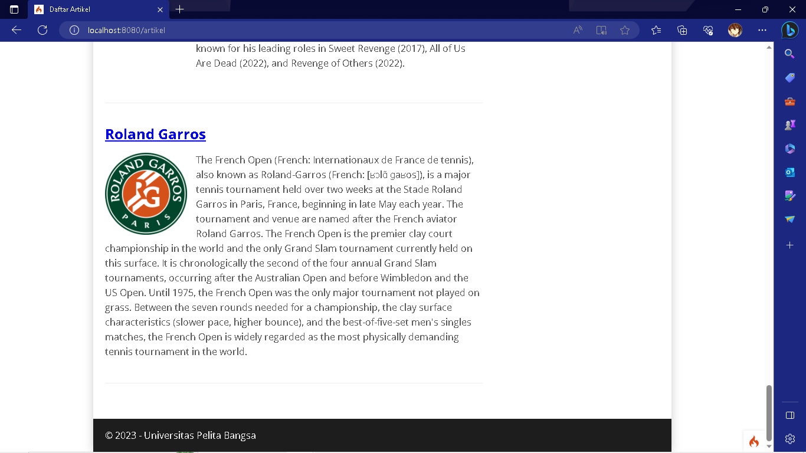

# Tugas Pemrograman Web 2
## Profil
| #               | Biodata                      |
| --------------- | ---------------------------- |
| **Nama**        | Muhammad Alwi Nur Fathihah   |
| **NIM**         | 312110388                    |
| **Kelas**       | TI.21.A.1                    |
| **Mata Kuliah** | Pemrograman Web 2            |

# Langkah-langkah Praktikum
## Upload Gambar pada Artikel

<p>Menambahkan fungsi unggah gambar pada tambah artikel.</P>

- Buka kembali Controller Artikel pada project sebelumnya, sesuaikan kode pada method
- add seperti berikut:

```php
public function add()
    {
        // validasi data.
        $validation = \Config\Services::validation();
        $validation->setRules(['judul' => 'required']);
        $isDataValid = $validation->withRequest($this->request)->run();
        if ($isDataValid) {
            $file = $this->request->getFile('gambar');
            $file->move(ROOTPATH . 'public/gambar');
            $artikel = new ArtikelModel();
            $artikel->insert([
                'judul' => $this->request->getPost('judul'),
                'isi' => $this->request->getPost('isi'),
                'slug' => url_title($this->request->getPost('judul')),
                'gambar' => $file->getName(),
            ]);
            return redirect('admin/artikel');
        }
        $title = "Tambah Artikel";
        return view('artikel/form_add', compact('title'));
    }
```

- Kemudian pada file views/artikel/form_add.php tambahkan field input file seperti berikut.

```php
<p>
    <input type="file" name="gambar">
</p>
```

- Dan sesuaikan tag form dengan menambahkan ecrypt type seperti berikut.

```php
<form action="" method="post" enctype="multipart/form-data">
```

<p>Ujicoba file upload dengan mengakses menu tambah artikel.</p>




## Pertanyaan dan Tugas
<p>Selesaikan programnya sesuai Langkah-langkah yang ada. Anda boleh melakukan improvisasi.</p>

## Laporan Praktikum
1. Melanjutkan praktikum sebelumnya pada repository dengan nama Lab9Web.
2. Kerjakan semua latihan yang diberikan sesuai urutannya.
3. Screenshot setiap perubahannya.
4. Update file README.md dan tuliskan penjelasan dari setiap langkah praktikum beserta
screenshotnya.
5. Commit hasilnya pada repository masing-masing.
6. Kirim URL repository pada e-learning ecampus.

**SELESAI**

<div>
<h2 align="center">Thanks For Reading!</h2>
<div align="center">
